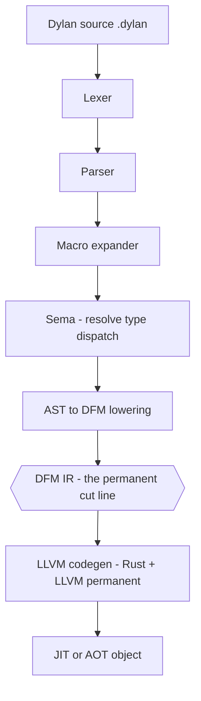
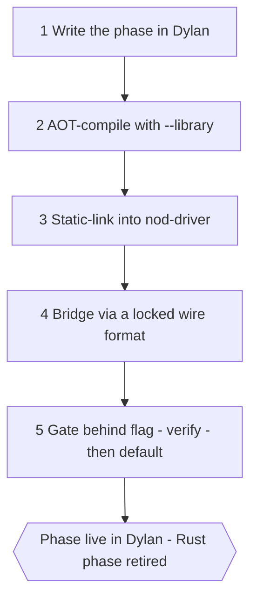
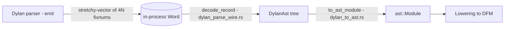
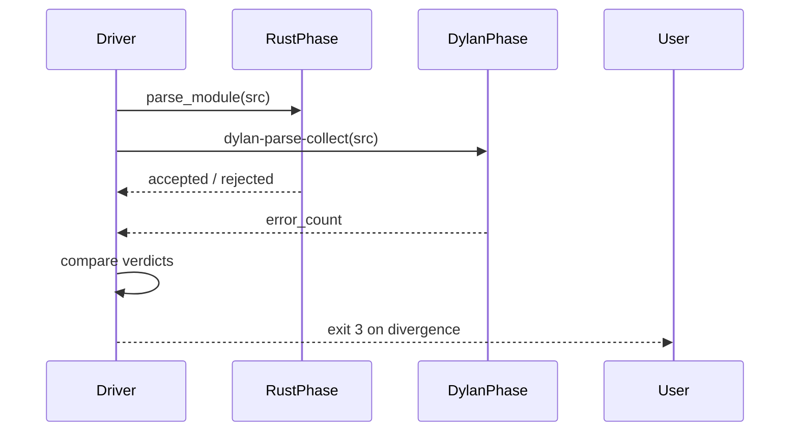
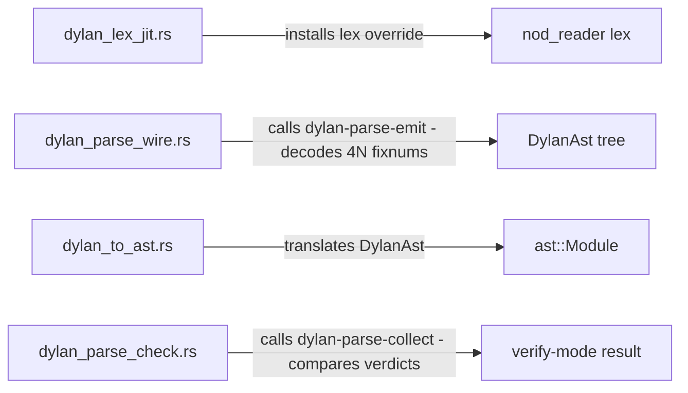

# Self-hosting — migrating the front-end to Dylan

The front-end (lexer, parser, macro expander, sema, AST→DFM lowering)
migrates from Rust to Dylan and is compiled by NewOpenDylan's own back-end.
The back-end (codegen, GC, JIT, linker, runtime) stays Rust+LLVM permanently.
DFM IR is the cut line that makes the migration safe and verifiable.

> Crates: `src/nod-driver` · Dylan front-end fixtures  ·  Status: lexer live, parser verify + AST emit, macro / sema / lowering queued

## Role in the pipeline

Self-hosting is not a pipeline stage — it is a *replacement mechanism* that
swaps each front-end stage from Rust to Dylan, one phase at a time, while
holding the back-end and DFM boundary constant.

Everything above the hexagon is the **front-end** — the migrating half.
Everything below is the **back-end** — permanent Rust+LLVM. The hexagon is
the only thing that crosses the seam. See [DFM](dfm.md) for the IR contract
and [Compiler overview](overview.md) for the full pipeline and crate map.

## Why the front-end migrates

The original plan ruled out self-hosting: "NewOpenDylan is a Rust compiler for
Dylan that ships a Dylan standard library." That was correct for the bring-up
years — writing a parser and sema in Rust avoided a chicken-and-egg bootstrap.

Then Sprints 45–51 proved the front-end ahead of schedule. The insight that
unlocked it (`docs/ARCHITECTURE.md`):

> *"Code gen is code gen — if the Dylan front-end emits the same DFM the Rust
> front-end does, LLVM emits the same machine code."*

There is **no reason to port the back-end**. DFM is the floor. A Rust-emitted
DFM module and a Dylan-emitted DFM module are the same data structure with the
same semantics; the back-end cannot tell which front-end produced it and does
not care. So the architecture is: front-end in Dylan, back-end in Rust, split
at DFM — the same division `rustc` draws (Rust front-end, LLVM back-end) and
that GHC draws (Haskell front-end, native/LLVM back-end).

The back-end is not a scaffold to be retired. It is the permanent native
substrate — shared with NewM2, NewCP, NewCormanLisp, NewBCPL, NewFB where
the GC core, JIT memory manager, and Windows FFI stack are portfolio-common.

## The five-step migration pattern

Every front-end phase migrates to Dylan by the same repeatable cadence
(`docs/ARCHITECTURE.md` §"The migration mechanism"). The lexer and parser
have already walked this path; macro expander, sema, and lowering are next.

**Step 1 — Write the phase in Dylan.**
The lexer (`tests/nod-tests/fixtures/dylan-lexer.dylan`) and parser
(`tests/nod-tests/fixtures/dylan-parser.dylan`) were first written as corpus
exercises in Sprints 45–46. They parsed the entire test corpus before any
integration work began. The Dylan source is designed fresh against the DRM —
not a line-for-line port of the Rust implementation.

**Step 2 — AOT-compile with `--library`.**
`nod-driver build --library` produces a `.obj` in `AotShape::StaticLibrary`
mode (`src/nod-driver/src/main.rs:159`, `main.rs:533`): source-language symbol
names are preserved verbatim (dashes and all), no synthetic `main` is injected,
and the resolver `nod_aot_resolve_relocs` is promoted to an external symbol.
The output for the combined lexer + parser shim is
`tests/nod-tests/fixtures/dylan-lex-shim.lib.obj`.

**Step 3 — Static-link into `nod-driver`.**
`build.rs` finds the `.obj`, passes it to the linker, and sets the
`dylan_lex_shim_linked` cfg flag. The phase's entry points —
`dylan-lex-collect`, `dylan-parse-emit`, `dylan-parse-collect` — become
`extern "C"` symbols in the driver process. No JIT engine to spin up, no
`register_methods` replay: the shim is just code already linked into the
process. A fresh checkout without the `.obj` compiles fine; `--lex-with-dylan`
prints a "build the shim first" message and falls back to the Rust lexer.

**Step 4 — Bridge via a locked wire format.**
Front-end output crosses the Rust/Dylan boundary as a flat, fixed-shape record
stream — never a shared data structure. The contracts are committed as docs
before either side's code is written. See "Wire-format discipline" below.

**Step 5 — Gate behind a flag, verify, then default.**
A `--…-with-dylan` flag (and matching `NOD_…` env var) selects the Dylan
phase. Verify-mode runs both implementations in parallel and compares output.
Once agreement is established across the corpus, the Dylan phase becomes the
default and the Rust phase is retired. See "Verify-mode" below.

## Wire-format discipline

Across a compiled-language seam you do not pass a data structure — you pass
bytes both sides agree on (`docs/ARCHITECTURE.md` §"Wire-format discipline").
Inside one language, handing someone a `Vec<Token>` is free; the type is the
interface. The instant the boundary is a different allocator and a different
type system, the data structure on one side does not exist on the other. The
only shared thing is a byte layout — and that layout is the interface.

Three earned patterns govern every wire format in this project:

- **Lock the contract first.** `docs/DYLAN_TOKEN_WIRE.md` and
  `docs/DYLAN_AST_WIRE.md` exist as committed specs that both sides obey.
  The spec going up first is why the lexer and parser emitters matched the
  Rust readers on first try.
- **Cheapest shape that carries the data.** Rich Dylan `<ast-*>` classes
  flatten to fixed-size integer records; the host reconstructs whatever local
  shape it needs. Each side's type system is a private implementation detail.
- **Spans, not values, when both sides hold the source.** The emitter ships
  `(VariableRef 527..537)`; the Rust reader does `&src[527..537]`. The source
  string is the blob both already have; the wire carries indices into it.

### Token wire format (`docs/DYLAN_TOKEN_WIRE.md` v1.0)

One token is one 16-byte little-endian record:

| Offset | Type | Field | Meaning |
|--------|------|-------|---------|
| 0 | `u32` | `kind` | `TokenKind` discriminant — append-only ordinal table |
| 4 | `u32` | `span_lo` | Start byte offset into the source buffer |
| 8 | `u32` | `span_hi` | End byte offset (exclusive) |
| 12 | `u32` | `_pad` | Reserved, must be zero |

The 16-byte size matches `nod_reader::Token` in memory, so the Rust
unmarshalling loop is a straight bytewise interpretation with zero pointer
arithmetic per field. The Dylan emitter (`tests/nod-tests/fixtures/dylan-lex-shim.dylan`)
classifies each `<token>` subclass to a Rust-ordinal via the generic
`token-rust-kind`, filters trivia and the module preamble, and packs records
into a `<stretchy-vector>` of `3N` fixnums `(kind, lo, hi)`. The Rust reader
(`src/nod-driver/src/dylan_lex_jit.rs`) walks the vector in strides of 3 and
calls `token_kind_from_ordinal` — an explicit match, not a transmute, so a
future enum reshuffle fails loudly rather than silently corrupting tokens.

### AST wire format (`docs/DYLAN_AST_WIRE.md` v1.0)

One AST node is one 4-fixnum record:

| Slot | Field | Meaning |
|------|-------|---------|
| 0 | `kind` | Node kind ordinal (36 kinds defined as of Sprint 51e) |
| 1 | `span_lo` | Source byte offset (start) |
| 2 | `span_hi` | Source byte offset (end, exclusive) |
| 3 | `subtree_size` | Record count of this node's subtree (self + all descendants). Leaf = 1 |

Records are packed pre-order: parent first, then children recursively.
Sibling boundaries are computed from `subtree_size` with no indirection:
`second_child = first_child + 4 * records[first_child + 3]`. The host walks
by recursive descent (`src/nod-driver/src/dylan_parse_wire.rs`, `decode_record`).
Each side's Dylan-class/Rust-struct shape is a private implementation detail;
only the integer record layout is shared.

The wire is navigated in-process: the Dylan parser returns a tagged-pointer
`<stretchy-vector>` Word; the Rust reader unboxes fixnums via
`Word::as_fixnum()` and walks the flat array.

Once `dylan_to_ast.rs` has produced a canonical `ast::Module`, lowering,
codegen, and everything downstream are identical to the Rust-parser path — the
back-end never sees the seam.

## Verify-mode

Before a Dylan phase becomes the default it runs in parallel with the Rust phase
and the outputs are asserted to agree. This is verify-mode — and it is not just
a confidence check; it is a correctness tool in both directions.

`--verify-parse` (`NOD_VERIFY_PARSE=1`) runs the Dylan parser
(`dylan-parse-collect` via `src/nod-driver/src/dylan_parse_check.rs:80`) and
compares its accept/reject verdict against the Rust parser's result. The Dylan
function returns a fixnum: `0` means accepted; positive means that many
top-level error constituents were found. Disagreement surfaces as exit code 3
with a `VerifyMismatch` diagnostic.

On its first run against the full corpus, verify-mode caught a **Rust** parser
bug: a `cond` form that the Dylan parser handled correctly but the Rust parser
rejected. Two front-ends that must agree is a stronger correctness signal than
either alone. `docs/ARCHITECTURE.md` states this directly: "two compilers are
better than one."

The verify-mode progression for each phase:

1. **Verdict verify** — do both parsers agree on accept/reject? (`--verify-parse`)
2. **AST verify** — does the Dylan AST wire output, translated to `ast::Module`,
   produce byte-identical `format_ast_module` output to the Rust parser?
   (`--parse-with-dylan` with the translation-coverage harness)
3. **Default** — Dylan phase is the shipping path; Rust phase retired.

The lexer completed step 3 (Sprint 51b). The parser completed step 1 (Sprint
51c) and step 2 (Sprints 51d–51e). Step 3 for the parser is the next milestone.

## Status by phase

| Phase | Dylan source | Status | Flag / command |
|-------|-------------|--------|----------------|
| **Lexer** | `tests/nod-tests/fixtures/dylan-lexer.dylan` | Live — byte-identical to Rust lexer | `--lex-with-dylan` / `NOD_LEX_WITH_DYLAN` |
| **Parser (verdict verify)** | `tests/nod-tests/fixtures/dylan-parser.dylan` | Live — agree on corpus accept/reject | `--verify-parse` / `NOD_VERIFY_PARSE` |
| **Parser (AST emit)** | same + `dylan-lex-shim.dylan` | Live — `dump-dylan-ast` round-trips; `--parse-with-dylan` replaces `parse_module` for covered constructs | `--parse-with-dylan` / `NOD_PARSE_WITH_DYLAN` |
| **Macro expander** | — | Queued (Sprint 52+) | — |
| **Sema / namespace** | — | Queued (Sprint 53+) | — |
| **AST to DFM lowering** | — | Queued (Sprint 54+) | — |
| **Front-end fully self-hosted** | — | Future milestone | all phases default |

Sources: `docs/ARCHITECTURE.md` §"What lives where" and §"Roadmap".

## The user-facing surface

The self-hosting machinery is exposed through three global flags on `nod-driver`
and three dedicated dump subcommands. Full reference is on [Driver](driver.md);
the summary for self-hosting work:

**Global flags** (accepted before or after any subcommand; also settable as env
vars so they work from `cargo test`):

| Flag | Env var | Sprint | Effect |
|------|---------|--------|--------|
| `--lex-with-dylan` | `NOD_LEX_WITH_DYLAN` | 51b | Installs the Dylan-compiled lexer as the `nod_reader` lex override for the whole process |
| `--verify-parse` | `NOD_VERIFY_PARSE` | 51c | Runs Dylan + Rust parsers on every `parse_module` call and asserts agreement; exit 3 on divergence; implies `--lex-with-dylan` |
| `--parse-with-dylan` | `NOD_PARSE_WITH_DYLAN` | 51e | Authoritative mode — Dylan parser output translated to `ast::Module` replaces `parse_module`; per-file fallback to Rust for unsupported constructs |

**Dump subcommands** (exercise the Dylan front-end as a standalone tool):

| Command | What it shows |
|---------|--------------|
| `nod-driver dump-dylan-tokens <file>` | Token stream from the Dylan-compiled lexer |
| `nod-driver dump-dylan-ast <file>` | Indented S-expression tree decoded from the AST wire format |
| `nod-driver parse-dylan <file>` | AST dump from the Dylan-compiled parser EXE (`--time` for wall-clock) |

The `dump-dylan-tokens` and `parse-dylan` subcommands build and cache a
self-contained EXE under `%TEMP%\nod-dylan-lexer-<hash>\` or
`nod-dylan-parser-<hash>\`; the hash covers source content, driver version
string, and driver binary mtime, so a rebuild or source change invalidates
automatically (`src/nod-driver/src/main.rs:208`, `main.rs:231`).

`dump-dylan-ast` uses the statically-linked shim path: it calls
`dylan-parse-emit` in-process, decodes the 4N-fixnum wire records via
`dylan_parse_wire::parse_to_tree`, and prints the `DylanAst` tree as an
indented S-expression (always implies `--lex-with-dylan`).

## The shim modules at a glance

Four modules in `src/nod-driver/src/` implement the bridging. No compiler stage
logic lives here; these are pure translation and dispatch layers.

`dylan_lex_jit::init` (`dylan_lex_jit.rs:92`) calls `nod_aot_resolve_relocs()`
once via `OnceLock` to wire up every relocation site the codegen pass emitted —
class metadata addresses, stub-table entries, string-literal pointers, generic
dispatch slots. Because lexer and parser share one combined `.obj`, the single
resolver call covers both. `dylan_parse_check::mark_available` is called from
the same init path so the verify path knows the resolver has fired
(`dylan_lex_jit.rs:132`).

## Where in the code

| File | Lines | Responsibility |
|------|-------|----------------|
| `src/nod-driver/src/dylan_lex_jit.rs` | ~299 | Shim init; `nod_aot_resolve_relocs` call; `lex` bridge marshalling `<byte-string>` / `<stretchy-vector>` |
| `src/nod-driver/src/dylan_parse_wire.rs` | ~333 | `dylan-parse-emit` call; `Kind` enum (36 variants); `DylanAst` struct; `decode_record` recursive descent |
| `src/nod-driver/src/dylan_to_ast.rs` | ~745 | `to_ast_module` — `DylanAst` → `ast::Module`; `Unsupported` fallback |
| `src/nod-driver/src/dylan_parse_check.rs` | ~135 | `dylan-parse-collect` call; `verify` entry point; `VerifyMismatch` |
| `tests/nod-tests/fixtures/dylan-lexer.dylan` | ~800 | The Dylan-written lexer — token class hierarchy, `lex`, `non-trivia-tokens` |
| `tests/nod-tests/fixtures/dylan-parser.dylan` | — | The Dylan-written parser |
| `tests/nod-tests/fixtures/dylan-lex-shim.dylan` | — | Shim entry points: `dylan-lex-collect`, `dylan-parse-emit`, `dylan-parse-collect`; `token-rust-kind` generic |
| `docs/DYLAN_TOKEN_WIRE.md` | — | Token wire contract (v1.0, 65 kind ordinals) |
| `docs/DYLAN_AST_WIRE.md` | — | AST wire contract (v1.0, 36 node kinds) |
| `docs/ARCHITECTURE.md` | — | Canonical front-end / back-end split; the 5-step pattern; wire-format discipline |

## Invariants and gotchas

- **`nod_aot_resolve_relocs` must run before any Dylan-side call.** It wires
  every relocation the codegen emitted; calling a Dylan function before it
  runs dereferences NULL. The `OnceLock` in `dylan_lex_jit.rs` enforces
  exactly-once semantics.
- **The `.obj` is not in source control.** A fresh checkout without
  `dylan-lex-shim.lib.obj` compiles fine; the `dylan_lex_shim_linked` cfg is
  unset and all Dylan-phase flags fall back to Rust with a clear message.
  Build the shim with `nod-driver build --library --project tests/nod-tests/fixtures/dylan-lex-shim.prj`.
- **`NOD_VERIFY_PARSE=1` implies `NOD_LEX_WITH_DYLAN=1`** (`main.rs:281`). The
  verify-parse path shares the lexer shim's resolver.
- **The wire formats are append-only, not reshuffled.** New token kinds go at
  the bottom of the `DYLAN_TOKEN_WIRE.md` §3 table and the
  `token_kind_from_ordinal` match simultaneously. New AST kinds go at the
  bottom of `DYLAN_AST_WIRE.md` §3. Any reshuffle bumps the major version.
- **`--parse-with-dylan` falls back per-file, not per-expression.** When
  `dylan_to_ast::to_ast_module` returns `Unsupported` for any item in a file,
  the driver re-parses that entire file with the Rust parser. The translation
  harness reports a translated-vs-fell-back tally to track coverage growth.
- **Multi-file AOT builds lower once from one merged AST** — whether that AST
  came from the Rust parser, the Dylan parser, or a mix. DFM indices are
  module-scoped and stable across the single lowering call. See [Driver](driver.md)
  and [DFM](dfm.md).

## See also

- [Compiler overview](overview.md) — the full pipeline and where each phase sits
- [DFM: the IR](dfm.md) — the permanent contract; why a Dylan-emitted DFM module is indistinguishable from a Rust-emitted one
- [Reader: lexer and parser](reader.md) — the Rust implementations being shadowed and eventually retired
- [Driver](driver.md) — the full flag and subcommand reference; the `build --library` / project-file mechanics
- [`docs/ARCHITECTURE.md`](../../ARCHITECTURE.md) — the canonical architecture statement; the five-step pattern; wire-format discipline; the roadmap table

---
[Manual home](../index.md) · [Compiler overview](overview.md)
